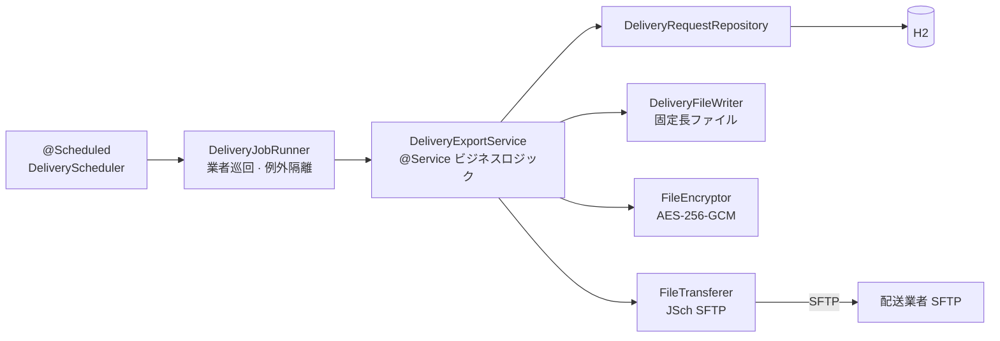

# カード配送 対外バッチインターフェース

[English](README.md) | [한국어](README.ko.md) | [简体中文](README.zh-CN.md) | **日本語**

> カード会社(内部)から配送業者(外部)へ配送依頼ファイルを定期的に送信する
> **File-based B2B Batch Integration** 構造を再現した学習用 PoC

リアルタイム API ではなく**ファイル**でやり取りする対外連携で繰り返し現れる問題
— 冪等性、部分的な失敗の隔離、書きかけのファイル、送信履歴 —
を実際に体験し、解決してみることが目的です。

<br>

## 🎯 学習目標

- ファイルベース連携で**状態マシン(`READY → REQUESTED`)による冪等性**の担保方法を身につける
- バッチがロールバックしても**履歴は残らなければならない理由**と `REQUIRES_NEW` による分離を体感する
- `.part` でアップロードしてから rename する対外連携の慣例が**なぜ必要か**を確認する
- 送信・暗号化・ファイル生成を**ポートインターフェースとして分離**し、SFTP を S3 に置き換えられる構造にする

<br>

## 🚀 機能要件

### バッチ実行

- バッチは**毎分**実行され、アプリケーション起動直後にも **1 回**実行される。
- バッチは有効状態(`active = true`)の配送業者をすべて巡回する。

### 配送依頼ファイルの送信

- 配送業者ごとに状態が `READY` の配送依頼のみを送信対象として取得する。
  - 対象がなければファイルを作らずにスキップする。
- 送信対象は**発行区分(`NEW` / `REN` / `RET`)ごとに分けて**それぞれ 1 つのファイルにする。
- 生成したファイルは **AES-256-GCM** で暗号化してから配送業者の SFTP サーバーへアップロードする。
- アップロードが終わると該当する配送依頼の状態を `READY → REQUESTED` に更新し、
  送信したファイル名と送信時刻を併せて記録する。
- バッチ 1 回の実行ごとに**バッチ履歴**(対象件数、送信件数、成功/失敗、失敗理由)を残す。

### 例外処理

- ある配送業者で例外が発生しても**他の配送業者への送信は継続する**。
- バッチ途中で失敗したら状態更新を**ロールバック**して `READY` を維持する。次のバッチが自動的に再試行する。
- **バッチがロールバックされても「失敗した」という履歴は残らなければならない。**

<br>

## 📄 インターフェース仕様

### レコード(固定長 132 文字)

| 項目 | 長さ | 寄せ | 備考 |
|---|---|---|---|
| 発行区分 | 3 | 左寄せ | `NEW` / `REN` / `RET` |
| カード番号 | 19 | 左寄せ | マスクした形のみ保管 |
| 受取人 | 10 | 左寄せ | 空白パディング |
| 住所 | 100 | 左寄せ | 空白パディング |

### トレーラ

最終行にはレコード識別子 `T` と件数 9 桁(0 パディング)を付ける。

```
T000000003
```

| 項目 | 長さ | 値 |
|---|---|---|
| レコード識別子 | 1 | `T` |
| 件数 | 9 | 右寄せ、0 パディング |

### ファイル名

```
CJX_NEW_20260911093000_CJX.dat.enc
```

| 区間 | 例 | 意味 |
|---|---|---|
| 配送業者コード | `CJX` | 受信先 |
| 発行区分 | `NEW` | ファイル種別 |
| バッチ ID | `20260911093000_CJX` | バッチ実行時刻(`yyyyMMddHHmmss`)+ 配送業者コード |
| `.dat` | — | 固定長の原本 |
| `.enc` | — | AES-256-GCM 暗号化の結果 |

ファイル名そのものが**冪等性キー**の役割を果たす。同じバッチ ID からは同じファイルしか作られない。

<br>

## 📐 プログラミング要件

- Java 17、Spring Boot 3.3.4 を使用する。
- DB は H2(in-memory、Oracle モード)+ Spring Data JPA を使用する。
- **`DeliveryExportService` は SFTP を一切知らないこと。**
  ファイル生成 / 暗号化 / 送信はそれぞれポートインターフェースに分離し、実装は `infrastructure` に置く。
- **バッチ周期・出力パス・暗号化キーをコードにハードコードしない。** `application.yml` に外出しする。
- ドメインオブジェクトは setter を開かず、意味のあるメソッド(`markRequested()`)で状態を変える。
- **履歴の記録はバッチトランザクションから分離する。** ロールバックされても失敗履歴は残らなければならない。
- **コミット単位は下記の機能リスト単位とする。**

<br>

## ✅ 実装する機能リスト

- [x] バッチ実行
  - [x] `@Scheduled` による定期実行(cron は外部設定)
  - [x] アプリケーション起動直後に 1 回実行
  - [x] 有効な配送業者の全巡回
  - [x] 配送業者単位の例外隔離 — 1 社が失敗しても残りは継続
- [x] 配送依頼ファイルの生成
  - [x] `READY` 状態の配送依頼のみ取得
  - [x] 発行区分ごとにグルーピングしてファイルを分割
  - [x] 固定長レコードの生成(132 文字)
  - [x] 件数トレーラの付加
  - [ ] バイト基準のパディング(EUC-KR)
- [x] 暗号化
  - [x] AES-256-GCM 暗号化
  - [x] IV をファイル先頭 12 バイトに付加
  - [x] GCM タグによる完全性検証
  - [ ] キーを外部ストア(KMS/Vault)から注入
- [x] SFTP 送信
  - [x] JSch(mwiede fork)によるアップロード
  - [x] `.part` でアップロードしてから rename — 書きかけファイルの受信を防止
  - [x] 接続タイムアウトの設定(10 秒)
  - [ ] `known_hosts` によるホストキー検証
- [x] 状態管理・履歴
  - [x] 送信成功時に `READY → REQUESTED` へ更新
  - [x] 送信ファイル名 / 送信時刻の記録
  - [x] バッチ履歴の記録(対象件数、送信件数、成功・失敗、失敗理由)
  - [x] 履歴は `REQUIRES_NEW` で分離 — バッチがロールバックしても履歴は残る
  - [ ] 配送結果の返信ファイル受信(`REQUESTED → DELIVERED` / `RETURNED`)
- [x] ユニットテスト(固定長ファイル生成 / AES-GCM 暗号・復号)

<br>

## 📤 実行結果

シードデータは配送業者 2 社(`CJX` 3 件 / `HNJ` 2 件)、発行区分 3 種で構成されています。

### 初回バッチ — 送信成功

```
배송 배치 시작 - 대상 배송업체 2곳
[CJX] SFTP 업로드 완료: upload/CJX_NEW_20260911093000_CJX.dat.enc
[CJX] NEW 2건 전송 완료 -> CJX_NEW_20260911093000_CJX.dat.enc
[CJX] SFTP 업로드 완료: upload/CJX_REN_20260911093000_CJX.dat.enc
[CJX] REN 1건 전송 완료 -> CJX_REN_20260911093000_CJX.dat.enc
[HNJ] SFTP 업로드 완료: upload/HNJ_NEW_20260911093000_HNJ.dat.enc
[HNJ] NEW 1건 전송 완료 -> HNJ_NEW_20260911093000_HNJ.dat.enc
[HNJ] SFTP 업로드 완료: upload/HNJ_RET_20260911093000_HNJ.dat.enc
[HNJ] RET 1건 전송 완료 -> HNJ_RET_20260911093000_HNJ.dat.enc
배송 배치 종료
```

### 次のバッチ — 対象なし(冪等性)

対象がすべて `REQUESTED` に変わっているため、同じ件を再送しません。

```
배송 배치 시작 - 대상 배송업체 2곳
[CJX] 전송 대상 없음
[HNJ] 전송 대상 없음
배송 배치 종료
```

### 送信失敗 — 業者隔離 + 履歴

1 社が失敗しても次の業者は継続され、ロールバックされても失敗履歴は残ります。

```
[CJX] 배치 실패 batchId=20260911093100_CJX
[CJX] 배치 실패, 다음 업체로 진행
[HNJ] NEW 1건 전송 완료 -> HNJ_NEW_20260911093100_HNJ.dat.enc
```

> ログメッセージはアプリケーションコードのものをそのまま出力しているため韓国語です。

<br>

## 🏗 アーキテクチャ



ポートとアダプタを分離したヘキサゴナルライト構造です。

```
com.poc.carddelivery
├── batch/
│   ├── scheduler/    # @Scheduled トリガー、起動時 1 回実行ランナー
│   └── job/          # DeliveryJobRunner — 配送業者の巡回、業者単位の例外隔離
├── domain/
│   ├── delivery/     # CardIssue、DeliveryRequest(状態マシン)、JobHistory
│   └── courier/      # 配送業者の設定(SFTP 接続情報)
├── application/      # DeliveryExportService + ポート 3 種
│   ├── DeliveryFileWriter   (ファイル生成ポート)
│   ├── FileEncryptor        (暗号化ポート)
│   └── FileTransferer       (送信ポート — SFTP → S3 に交換可能)
└── infrastructure/
    ├── file/         # 固定長ファイルの生成
    ├── crypto/       # AES-256-GCM
    ├── sftp/         # JSch(mwiede fork)アップローダ
    └── persistence/  # Spring Data JPA(domain パッケージの Repository インターフェースを使用)
```

送信ポートがインターフェースとして分離されているため、SFTP を S3 や他の送信手段に置き換えられます。

<br>

## 🛠 技術スタック

| 区分 | 使用技術 |
|---|---|
| Language | Java 17 |
| Framework | Spring Boot 3.3.4 |
| 永続化 | Spring Data JPA、H2 (in-memory、Oracle モード) |
| SFTP | [mwiede/jsch](https://github.com/mwiede/jsch) 0.2.20 |
| ビルド | Gradle |
| ローカル SFTP サーバー | `atmoz/sftp` (Docker) |

<br>

## 🏃 実行方法

```bash
# 1. ローカル配送業者 SFTP サーバーの起動
docker compose up -d

# 2. Gradle wrapper の生成(初回のみ)
gradle wrapper --gradle-version 8.10

# 3. アプリケーションの実行 — 起動直後 1 回 + 毎分スケジュール
./gradlew bootRun

# 4. アップロード結果の確認
ls docker/sftp-data/
# CJX_NEW_20260911093000_CJX.dat.enc などが見えれば成功
```

| 区分 | アドレス |
|---|---|
| H2 コンソール | `http://localhost:8080/h2-console` (JDBC URL: `jdbc:h2:mem:carddelivery`、ユーザー `sa`、パスワードなし) |
| ローカル SFTP | `localhost:2222` (`docker-compose.yml`) |
| アップロード結果 | `docker/sftp-data/` |

H2 コンソールで状態と履歴を確認できます。

```sql
SELECT * FROM delivery_request;  -- status = REQUESTED を確認
SELECT * FROM job_history;
```

### テスト

```bash
./gradlew test
```

- `FixedLengthDeliveryFileWriterTest` — 固定長レコード / トレーラ仕様の検証
- `AesGcmFileEncryptorTest` — AES-256-GCM の暗号・復号および完全性の検証

<br>

## 🤔 設計で悩んだ点

| テーマ | 選択 | 理由 |
|---|---|---|
| 冪等性 | 状態ベースの取得(`READY` のみ対象)+ トランザクションのロールバック | 途中で失敗しても `READY` が維持され、次のバッチが自動で再試行する。二重送信を防ぐ |
| 履歴の記録 | `REQUIRES_NEW` の別トランザクション | バッチがロールバックされても「失敗した」履歴は残らなければならない |
| SFTP アップロード | `.part` でアップロードしてから rename | 受信側が書きかけのファイルを取っていく古典的な対外連携事故を防ぐ |
| 業者の隔離 | 配送業者単位の try-catch | A 社の障害が B 社への送信を止めない |
| 暗号化 | AES-256-GCM、IV をファイル先頭 12 バイトに | 機密性と完全性(GCM タグ)を同時に得られる |
| ファイル分割 | 発行区分ごとのファイル | 受信側が区分ごとに異なる処理を走らせる実際の仕様に合わせた |
| 送信手段 | `FileTransferer` ポートで抽象化 | SFTP → S3 などに置き換えてもビジネスロジックはそのまま |

<br>

## ⚠️ 既知の簡略化

PoC の範囲として意図的に残した部分です。実運用の前に必ず解消する必要があります。

- **固定長パディングが文字数基準** — 実務の仕様は通常 EUC-KR の**バイト**基準です。韓国語などが混ざると長さがずれます。
- **AES キーが `application.yml` に平文** — 実運用では KMS/Vault とキーローテーションが必要です。リポジトリにあるキーはテスト用で、実運用には使えません。
- **`StrictHostKeyChecking=no`** — ホストキー検証を省略しています。実運用では `known_hosts` への登録が必須です。
- **SFTP アカウントがシードデータに平文** — ローカル Docker テスト専用のアカウントです。
- **送信成功と状態更新の間でプロセスが落ちるシナリオが未解決** — ファイルは上がったのに状態が `READY` のまま残り、再送される可能性があります。ファイル名によるリモート存在確認、または受信側の ACK ファイル設計が次の課題です。

<br>

## 🗺 今後実装するもの

- [ ] 配送結果の返信ファイル受信 (inbound: `REQUESTED → DELIVERED` / `RETURNED`)
- [ ] Spring Batch へのリファクタリング後の比較 (JobRepository、chunk、retry)
- [ ] バイト基準の固定長パディング (EUC-KR)
- [ ] Testcontainers ベースの SFTP 統合テスト
