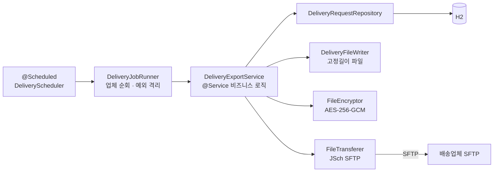

# 카드 배송 대외계 배치 인터페이스

[English](README.md) | **한국어** | [简体中文](README.zh-CN.md) | [日本語](README.ja.md)

> 카드사(내부)에서 배송업체(외부)로 배송요청 파일을 주기적으로 전송하는
> **File-based B2B Batch Integration** 구조를 재현한 학습용 PoC

실시간 API가 아니라 **파일**로 주고받는 대외계 연동에서 반복적으로 등장하는 문제
— 멱등성, 부분 실패 격리, 쓰다 만 파일, 전송 이력 — 를 직접 겪어보고 해결해보는 것이 목표다.

<br>

## 🎯 학습 목표

- 파일 기반 연동에서 **멱등성을 상태 머신(`READY → REQUESTED`)으로** 보장하는 방법을 익힌다
- 배치 트랜잭션이 롤백돼도 **이력은 남아야 하는 이유**와 `REQUIRES_NEW` 분리를 체감한다
- `.part` 업로드 후 rename이라는 대외계 관례가 **왜 필요한지** 확인한다
- 전송/암호화/파일생성을 **포트 인터페이스로 분리**해 SFTP를 S3로 교체 가능한 구조를 만든다

<br>

## 🚀 기능 요구사항

### 배치 실행

- 배치는 **매 분** 실행되며, 애플리케이션 기동 직후에도 **1회** 실행된다.
- 배치는 활성 상태(`active = true`)인 배송업체를 모두 순회한다.

### 배송요청 파일 전송

- 배송업체별로 상태가 `READY`인 배송요청만 전송 대상으로 조회한다.
  - 대상이 없으면 아무 파일도 만들지 않고 넘어간다.
- 전송 대상은 **발급유형(`NEW` / `REN` / `RET`)별로 나누어** 각각 하나의 파일로 만든다.
- 생성한 파일은 **AES-256-GCM**으로 암호화한 뒤 배송업체 SFTP 서버로 업로드한다.
- 업로드가 끝나면 해당 배송요청의 상태를 `READY → REQUESTED`로 갱신하고,
  전송한 파일명과 전송 시각을 함께 기록한다.
- 배치 1회 실행마다 **배치 이력**(대상 건수, 전송 건수, 성공/실패, 실패 사유)을 남긴다.

### 예외 처리

- 한 배송업체에서 예외가 발생해도 **다른 배송업체의 전송은 계속 진행**한다.
- 배치 도중 실패하면 상태 갱신을 **롤백**해 `READY`를 유지한다. 다음 배치가 자동으로 재시도한다.
- 배치가 롤백되더라도 **"실패했다"는 이력은 남아야 한다.**

<br>

## 📄 인터페이스 규격

### 레코드 (고정길이 132자)

| 구분 | 길이 | 정렬 | 비고 |
|---|---|---|---|
| 발급유형 | 3 | 좌측정렬 | `NEW` / `REN` / `RET` |
| 카드번호 | 19 | 좌측정렬 | 마스킹된 형태만 보관 |
| 수령인 | 10 | 좌측정렬 | 공백 패딩 |
| 주소 | 100 | 좌측정렬 | 공백 패딩 |

### 트레일러

마지막 줄에는 레코드 구분자 `T`와 건수 9자리(0 패딩)를 붙인다.

```
T000000003
```

| 구분 | 길이 | 값 |
|---|---|---|
| 레코드 구분자 | 1 | `T` |
| 건수 | 9 | 우측정렬, 0 패딩 |

### 파일명

```
CJX_NEW_20260911093000_CJX.dat.enc
```

| 구간 | 예시 | 의미 |
|---|---|---|
| 배송업체 코드 | `CJX` | 수신처 |
| 발급유형 | `NEW` | 파일 종류 |
| 배치 ID | `20260911093000_CJX` | 배치 실행 시각(`yyyyMMddHHmmss`) + 배송업체 코드 |
| `.dat` | — | 고정길이 원본 |
| `.enc` | — | AES-256-GCM 암호화 결과 |

파일명 자체가 **멱등성 키** 역할을 한다. 같은 배치 ID로는 같은 파일만 만들어진다.

<br>

## 📐 프로그래밍 요구사항

- Java 17, Spring Boot 3.3.4 를 사용한다.
- DB는 H2(in-memory, Oracle 모드) + Spring Data JPA 를 사용한다.
- **`DeliveryExportService`는 SFTP를 전혀 몰라야 한다.**
  파일 생성 / 암호화 / 전송은 각각 포트 인터페이스로 분리하고, 구현체는 `infrastructure`에 둔다.
- **배치 주기·출력 경로·암호화 키는 코드에 하드코딩하지 않는다.** `application.yml`로 뺀다.
- 도메인 객체는 setter를 열지 않고, 의미 있는 메서드(`markRequested()`)로 상태를 바꾼다.
- **이력 기록은 배치 트랜잭션과 분리한다.** 롤백되더라도 실패 이력은 남아야 한다.
- **커밋 단위는 아래 기능 목록 단위로 한다.**

<br>

## ✅ 구현할 기능 목록

- [x] 배치 실행
  - [x] `@Scheduled` 기반 주기 실행 (cron 외부 설정)
  - [x] 애플리케이션 기동 직후 1회 실행
  - [x] 활성 배송업체 전체 순회
  - [x] 배송업체 단위 예외 격리 — 한 곳이 실패해도 나머지는 계속 진행
- [x] 배송요청 파일 생성
  - [x] `READY` 상태 배송요청만 조회
  - [x] 발급유형별 그룹핑 후 파일 분리
  - [x] 고정길이 레코드 생성 (132자)
  - [x] 건수 트레일러 추가
  - [ ] 바이트 기준 패딩 (EUC-KR)
- [x] 암호화
  - [x] AES-256-GCM 암호화
  - [x] IV를 파일 선두 12바이트에 부착
  - [x] GCM 태그로 무결성 검증
  - [ ] 키를 외부 저장소(KMS/Vault)에서 주입
- [x] SFTP 전송
  - [x] JSch(mwiede fork) 기반 업로드
  - [x] `.part`로 업로드 후 rename — 쓰다 만 파일 수신 방지
  - [x] 접속 타임아웃 설정 (10초)
  - [ ] `known_hosts` 기반 호스트키 검증
- [x] 상태 관리 · 이력
  - [x] 전송 성공 시 `READY → REQUESTED` 갱신
  - [x] 전송 파일명 / 전송 시각 기록
  - [x] 배치 이력 기록 (대상 건수, 전송 건수, 성공·실패, 실패 사유)
  - [x] 이력은 `REQUIRES_NEW`로 분리 — 배치가 롤백돼도 이력은 남음
  - [ ] 배송결과 회신 파일 수신 (`REQUESTED → DELIVERED` / `RETURNED`)
- [x] 단위 테스트 (고정길이 파일 생성 / AES-GCM 암복호화)

<br>

## 📤 실행 결과

시드 데이터는 배송업체 2곳(`CJX` 3건 / `HNJ` 2건), 발급유형 3종으로 구성되어 있다.

### 첫 배치 — 전송 성공

```
배송 배치 시작 - 대상 배송업체 2곳
[CJX] SFTP 업로드 완료: upload/CJX_NEW_20260911093000_CJX.dat.enc
[CJX] NEW 2건 전송 완료 -> CJX_NEW_20260911093000_CJX.dat.enc
[CJX] SFTP 업로드 완료: upload/CJX_REN_20260911093000_CJX.dat.enc
[CJX] REN 1건 전송 완료 -> CJX_REN_20260911093000_CJX.dat.enc
[HNJ] SFTP 업로드 완료: upload/HNJ_NEW_20260911093000_HNJ.dat.enc
[HNJ] NEW 1건 전송 완료 -> HNJ_NEW_20260911093000_HNJ.dat.enc
[HNJ] SFTP 업로드 완료: upload/HNJ_RET_20260911093000_HNJ.dat.enc
[HNJ] RET 1건 전송 완료 -> HNJ_RET_20260911093000_HNJ.dat.enc
배송 배치 종료
```

### 다음 배치 — 대상 없음 (멱등성)

대상이 모두 `REQUESTED`로 바뀌었으므로 같은 건을 다시 보내지 않는다.

```
배송 배치 시작 - 대상 배송업체 2곳
[CJX] 전송 대상 없음
[HNJ] 전송 대상 없음
배송 배치 종료
```

### 전송 실패 — 업체 격리 + 이력

한 업체가 실패해도 다음 업체는 계속 진행되고, 롤백돼도 실패 이력은 남는다.

```
[CJX] 배치 실패 batchId=20260911093100_CJX
[CJX] 배치 실패, 다음 업체로 진행
[HNJ] NEW 1건 전송 완료 -> HNJ_NEW_20260911093100_HNJ.dat.enc
```

<br>

## 🏗 아키텍처



포트와 어댑터를 분리한 헥사고날 라이트 구조다.

```
com.poc.carddelivery
├── batch/
│   ├── scheduler/    # @Scheduled 트리거, 기동 시 1회 실행 러너
│   └── job/          # DeliveryJobRunner — 배송업체 순회, 업체 단위 예외 격리
├── domain/
│   ├── delivery/     # CardIssue, DeliveryRequest(상태 머신), JobHistory
│   └── courier/      # 배송업체 설정 (SFTP 접속정보)
├── application/      # DeliveryExportService + 포트 3종
│   ├── DeliveryFileWriter   (파일 생성 포트)
│   ├── FileEncryptor        (암호화 포트)
│   └── FileTransferer       (전송 포트 — SFTP → S3 교체 가능)
└── infrastructure/
    ├── file/         # 고정길이 파일 생성
    ├── crypto/       # AES-256-GCM
    ├── sftp/         # JSch(mwiede fork) 업로더
    └── persistence/  # Spring Data JPA (도메인 패키지의 Repository 인터페이스 사용)
```

전송 포트가 인터페이스로 분리되어 있어 SFTP를 S3나 다른 전송 수단으로 교체할 수 있다.

<br>

## 🛠 기술 스택

| 구분 | 사용 기술 |
|---|---|
| Language | Java 17 |
| Framework | Spring Boot 3.3.4 |
| 영속성 | Spring Data JPA, H2 (in-memory, Oracle 모드) |
| SFTP | [mwiede/jsch](https://github.com/mwiede/jsch) 0.2.20 |
| 빌드 | Gradle |
| 로컬 SFTP 서버 | `atmoz/sftp` (Docker) |

<br>

## 🏃 실행 방법

```bash
# 1. 로컬 배송업체 SFTP 서버 기동
docker compose up -d

# 2. Gradle wrapper 생성 (최초 1회)
gradle wrapper --gradle-version 8.10

# 3. 애플리케이션 실행 — 기동 직후 1회 + 매 분 스케줄
./gradlew bootRun

# 4. 업로드 결과 확인
ls docker/sftp-data/
# CJX_NEW_20260911093000_CJX.dat.enc 등이 보이면 성공
```

| 구분 | 주소 |
|---|---|
| H2 콘솔 | `http://localhost:8080/h2-console` (JDBC URL: `jdbc:h2:mem:carddelivery`, 사용자 `sa`, 비밀번호 없음) |
| 로컬 SFTP | `localhost:2222` (`docker-compose.yml`) |
| 업로드 결과 | `docker/sftp-data/` |

H2 콘솔에서 상태와 이력을 확인할 수 있다.

```sql
SELECT * FROM delivery_request;  -- status = REQUESTED 확인
SELECT * FROM job_history;
```

### 테스트

```bash
./gradlew test
```

- `FixedLengthDeliveryFileWriterTest` — 고정길이 레코드 / 트레일러 규격 검증
- `AesGcmFileEncryptorTest` — AES-256-GCM 암복호화 및 무결성 검증

<br>

## 🤔 설계하며 고민한 점

| 주제 | 선택 | 이유 |
|---|---|---|
| 멱등성 | 상태 기반 조회(`READY`만 대상) + 트랜잭션 롤백 | 중간 실패 시 `READY`가 유지되어 다음 배치가 자동 재시도한다. 이중 전송을 막는다 |
| 이력 기록 | `REQUIRES_NEW` 별도 트랜잭션 | 배치가 롤백돼도 "실패했다"는 이력은 남아야 한다 |
| SFTP 업로드 | `.part`로 올린 뒤 rename | 수신측이 쓰다 만 파일을 집어가는 고전적인 대외계 사고를 막는다 |
| 업체 격리 | 배송업체 단위 try-catch | A업체 장애가 B업체 전송을 막지 않는다 |
| 암호화 | AES-256-GCM, IV 파일 선두 12바이트 | 기밀성과 무결성(GCM 태그)을 함께 얻는다 |
| 파일 분리 | 발급유형별 파일 | 수신측이 유형별로 다른 처리를 태우는 실제 규격을 따랐다 |
| 전송 수단 | `FileTransferer` 포트로 추상화 | SFTP → S3 등으로 교체해도 비즈니스 로직은 그대로다 |

<br>

## ⚠️ 알려진 단순화

PoC 범위로 의도적으로 남겨둔 부분이다. 실전 적용 전에 반드시 해소해야 한다.

- **고정길이 패딩이 문자 수 기준** — 실무 규격은 보통 EUC-KR **바이트** 기준이다. 한글이 섞이면 길이가 어긋난다.
- **AES 키가 `application.yml`에 평문** — 실전은 KMS/Vault + 키 로테이션이 필요하다. 저장소에 있는 키는 테스트용이며 실제 운영에 쓸 수 없다.
- **`StrictHostKeyChecking=no`** — 호스트키 검증을 생략하고 있다. 실전은 `known_hosts` 등록이 필수다.
- **SFTP 계정이 시드 데이터에 평문** — 로컬 도커 테스트 전용 계정이다.
- **전송 성공과 상태 갱신 사이 프로세스 다운 시나리오 미해결** — 파일은 올라갔는데 상태는 `READY`로 남아 재전송될 수 있다. 파일명 기준 원격 존재 확인 또는 수신측 ACK 파일 설계가 다음 과제다.

<br>

## 🗺 앞으로 구현할 것

- [ ] 배송결과 회신 파일 수신 (inbound: `REQUESTED → DELIVERED` / `RETURNED`)
- [ ] Spring Batch로 리팩토링 후 비교 (JobRepository, chunk, retry)
- [ ] 바이트 기준 고정길이 패딩 (EUC-KR)
- [ ] Testcontainers 기반 SFTP 통합 테스트
