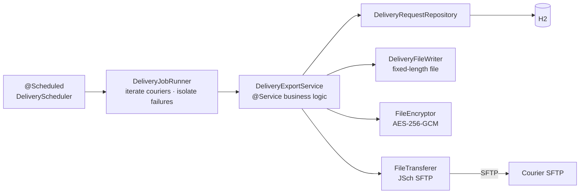

# Card Delivery B2B Batch Interface

**English** | [한국어](README.ko.md) | [简体中文](README.zh-CN.md) | [日本語](README.ja.md)

> A learning PoC that recreates the **file-based B2B batch integration** a card issuer
> (internal) uses to push delivery request files to a courier (external) on a schedule

The point is to run into — and work through — the problems that keep coming up when an
external integration exchanges **files** rather than live API calls: idempotency,
isolating partial failures, half-written files, and transfer history.

<br>

## 🎯 Learning Goals

- Learn how to guarantee **idempotency with a state machine** (`READY → REQUESTED`) in a file-based integration
- Feel out **why history has to survive a rollback**, and how `REQUIRES_NEW` separates it
- See **why** the B2B convention of uploading as `.part` and then renaming exists
- Split file writing, encryption and transfer into **ports** so SFTP can be swapped for S3

<br>

## 🚀 Functional Requirements

### Batch execution

- The batch runs **every minute**, plus **once** right after the application starts.
- The batch iterates over every active courier (`active = true`).

### Delivery request file transfer

- For each courier, only delivery requests in `READY` are picked up.
  - With nothing to send, no file is created and the courier is skipped.
- Targets are **split by issue type (`NEW` / `REN` / `RET`)**, one file per type.
- Each file is encrypted with **AES-256-GCM** and uploaded to the courier's SFTP server.
- Once the upload finishes, the delivery request moves from `READY` to `REQUESTED`,
  recording the file name it went out in and the time it was sent.
- Every batch run leaves a **job history** entry (targets, sent count, success/failure, failure reason).

### Error handling

- An exception at one courier must **not stop the transfers for the others**.
- A failure mid-batch **rolls back** the status update so it stays `READY`. The next batch retries it automatically.
- **Even when the batch rolls back, the "this failed" history entry has to survive.**

<br>

## 📄 Interface Specification

### Record (fixed length, 132 characters)

| Field | Length | Alignment | Notes |
|---|---|---|---|
| Issue type | 3 | Left | `NEW` / `REN` / `RET` |
| Card number | 19 | Left | Only the masked form is kept |
| Recipient | 10 | Left | Space padded |
| Address | 100 | Left | Space padded |

### Trailer

The last line carries the record marker `T` and a 9-digit count (zero padded).

```
T000000003
```

| Field | Length | Value |
|---|---|---|
| Record marker | 1 | `T` |
| Count | 9 | Right aligned, zero padded |

### File name

```
CJX_NEW_20260911093000_CJX.dat.enc
```

| Segment | Example | Meaning |
|---|---|---|
| Courier code | `CJX` | Recipient |
| Issue type | `NEW` | File kind |
| Batch ID | `20260911093000_CJX` | Batch start time (`yyyyMMddHHmmss`) + courier code |
| `.dat` | — | Fixed-length original |
| `.enc` | — | AES-256-GCM encrypted result |

The file name itself acts as the **idempotency key**. One batch ID only ever produces the same file.

<br>

## 📐 Programming Requirements

- Use Java 17 and Spring Boot 3.3.4.
- Use H2 (in-memory, Oracle mode) with Spring Data JPA.
- **`DeliveryExportService` must know nothing about SFTP.**
  File writing, encryption and transfer each get a port interface; implementations live in `infrastructure`.
- **Never hardcode the schedule, output path or encryption key.** They belong in `application.yml`.
- Domain objects expose no setters; state changes go through meaningful methods (`markRequested()`).
- **Keep history recording out of the batch transaction.** A failure entry has to survive a rollback.
- **Commit granularity follows the feature checklist below.**

<br>

## ✅ Feature Checklist

- [x] Batch execution
  - [x] Scheduled runs with `@Scheduled` (cron externalized)
  - [x] One run right after application startup
  - [x] Iterate over every active courier
  - [x] Per-courier exception isolation — one failure doesn't stop the rest
- [x] Delivery request file writing
  - [x] Query only `READY` delivery requests
  - [x] Group by issue type and split into separate files
  - [x] Write fixed-length records (132 characters)
  - [x] Append the count trailer
  - [ ] Byte-based padding (EUC-KR)
- [x] Encryption
  - [x] AES-256-GCM
  - [x] Prepend the 12-byte IV to the file
  - [x] Integrity check via the GCM tag
  - [ ] Inject the key from an external store (KMS/Vault)
- [x] SFTP transfer
  - [x] Upload with JSch (mwiede fork)
  - [x] Upload as `.part`, then rename — keeps half-written files from being picked up
  - [x] Connection timeout (10s)
  - [ ] Host key verification against `known_hosts`
- [x] State and history
  - [x] `READY → REQUESTED` on a successful transfer
  - [x] Record the file name and the time sent
  - [x] Record job history (targets, sent count, success/failure, failure reason)
  - [x] History runs in `REQUIRES_NEW` — it survives a batch rollback
  - [ ] Inbound delivery result files (`REQUESTED → DELIVERED` / `RETURNED`)
- [x] Unit tests (fixed-length file writing / AES-GCM round trip)

<br>

## 📤 Results

The seed data has two couriers (`CJX` with 3 requests, `HNJ` with 2) across three issue types.

### First batch — transfers succeed

```
배송 배치 시작 - 대상 배송업체 2곳
[CJX] SFTP 업로드 완료: upload/CJX_NEW_20260911093000_CJX.dat.enc
[CJX] NEW 2건 전송 완료 -> CJX_NEW_20260911093000_CJX.dat.enc
[CJX] SFTP 업로드 완료: upload/CJX_REN_20260911093000_CJX.dat.enc
[CJX] REN 1건 전송 완료 -> CJX_REN_20260911093000_CJX.dat.enc
[HNJ] SFTP 업로드 완료: upload/HNJ_NEW_20260911093000_HNJ.dat.enc
[HNJ] NEW 1건 전송 완료 -> HNJ_NEW_20260911093000_HNJ.dat.enc
[HNJ] SFTP 업로드 완료: upload/HNJ_RET_20260911093000_HNJ.dat.enc
[HNJ] RET 1건 전송 완료 -> HNJ_RET_20260911093000_HNJ.dat.enc
배송 배치 종료
```

### Next batch — nothing to send (idempotency)

Everything moved to `REQUESTED`, so the same requests are never sent twice.

```
배송 배치 시작 - 대상 배송업체 2곳
[CJX] 전송 대상 없음
[HNJ] 전송 대상 없음
배송 배치 종료
```

### A transfer fails — isolation and history

One courier failing doesn't stop the next, and the failure entry survives the rollback.

```
[CJX] 배치 실패 batchId=20260911093100_CJX
[CJX] 배치 실패, 다음 업체로 진행
[HNJ] NEW 1건 전송 완료 -> HNJ_NEW_20260911093100_HNJ.dat.enc
```

> Log messages are in Korean because they come straight from the application code.

<br>

## 🏗 Architecture



A hexagonal-lite layout that separates ports from adapters.

```
com.poc.carddelivery
├── batch/
│   ├── scheduler/    # @Scheduled trigger, startup runner
│   └── job/          # DeliveryJobRunner — iterates couriers, isolates per-courier failures
├── domain/
│   ├── delivery/     # CardIssue, DeliveryRequest (state machine), JobHistory
│   └── courier/      # Courier configuration (SFTP credentials)
├── application/      # DeliveryExportService + 3 ports
│   ├── DeliveryFileWriter   (file writing port)
│   ├── FileEncryptor        (encryption port)
│   └── FileTransferer       (transfer port — SFTP can become S3)
└── infrastructure/
    ├── file/         # fixed-length file writing
    ├── crypto/       # AES-256-GCM
    ├── sftp/         # JSch (mwiede fork) uploader
    └── persistence/  # Spring Data JPA (implements the repository interfaces in domain)
```

Because the transfer port is an interface, SFTP can be swapped for S3 or any other transport.

<br>

## 🛠 Tech Stack

| Area | Technology |
|---|---|
| Language | Java 17 |
| Framework | Spring Boot 3.3.4 |
| Persistence | Spring Data JPA, H2 (in-memory, Oracle mode) |
| SFTP | [mwiede/jsch](https://github.com/mwiede/jsch) 0.2.20 |
| Build | Gradle |
| Local SFTP server | `atmoz/sftp` (Docker) |

<br>

## 🏃 Getting Started

```bash
# 1. Start the local courier SFTP server
docker compose up -d

# 2. Generate the Gradle wrapper (first time only)
gradle wrapper --gradle-version 8.10

# 3. Run the application — once at startup, then every minute
./gradlew bootRun

# 4. Check what was uploaded
ls docker/sftp-data/
# seeing CJX_NEW_20260911093000_CJX.dat.enc and friends means it worked
```

| Item | Address |
|---|---|
| H2 console | `http://localhost:8080/h2-console` (JDBC URL `jdbc:h2:mem:carddelivery`, user `sa`, no password) |
| Local SFTP | `localhost:2222` (`docker-compose.yml`) |
| Uploaded files | `docker/sftp-data/` |

State and history can be inspected in the H2 console.

```sql
SELECT * FROM delivery_request;  -- check status = REQUESTED
SELECT * FROM job_history;
```

### Tests

```bash
./gradlew test
```

- `FixedLengthDeliveryFileWriterTest` — verifies the fixed-length record and trailer spec
- `AesGcmFileEncryptorTest` — verifies the AES-256-GCM round trip and integrity check

<br>

## 🤔 Design Decisions

| Topic | Choice | Why |
|---|---|---|
| Idempotency | State-based query (`READY` only) + transaction rollback | A mid-way failure leaves the row `READY`, so the next batch retries it. Double sends are ruled out |
| History | Separate `REQUIRES_NEW` transaction | Even when the batch rolls back, the "this failed" entry has to survive |
| SFTP upload | Upload as `.part`, then rename | Prevents the classic B2B incident of the receiver picking up a half-written file |
| Courier isolation | try-catch per courier | An outage at courier A must not block transfers to courier B |
| Encryption | AES-256-GCM, 12-byte IV at the head of the file | Confidentiality and integrity (the GCM tag) in one step |
| File splitting | One file per issue type | Follows the real-world spec where the receiver routes each type differently |
| Transport | Abstracted behind the `FileTransferer` port | Switching SFTP for S3 leaves the business logic untouched |

<br>

## ⚠️ Known Simplifications

Deliberately left out to keep the PoC small. Each has to be resolved before any real use.

- **Fixed-length padding counts characters** — real specs usually count EUC-KR **bytes**. Mixing in Korean text throws the lengths off.
- **The AES key sits in `application.yml` in plaintext** — real systems need KMS/Vault plus key rotation. The key in this repository is for testing and cannot be used in production.
- **`StrictHostKeyChecking=no`** — host key verification is skipped. Real systems must register `known_hosts`.
- **SFTP credentials are plaintext in the seed data** — they belong to the local Docker test container only.
- **The process-crash window between a successful transfer and the status update is unresolved** — the file can be uploaded while the row stays `READY`, so it gets sent again. Checking the remote for the file name, or designing an ACK file from the receiver, is the next task.

<br>

## 🗺 Roadmap

- [ ] Inbound delivery result files (`REQUESTED → DELIVERED` / `RETURNED`)
- [ ] Refactor onto Spring Batch and compare (JobRepository, chunk, retry)
- [ ] Byte-based fixed-length padding (EUC-KR)
- [ ] SFTP integration tests with Testcontainers
