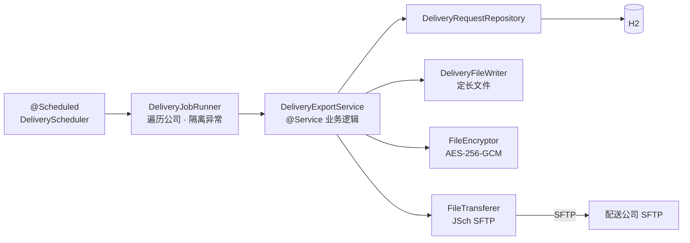

# 发卡配送对外批处理接口

[English](README.md) | [한국어](README.ko.md) | **简体中文** | [日本語](README.ja.md)

> 复现发卡方（内部）向配送公司（外部）定期发送配送请求文件的
> **File-based B2B Batch Integration** 结构的学习型 PoC

目标是亲自遇到并解决用**文件**（而非实时 API）做对外对接时反复出现的问题
—— 幂等性、局部失败隔离、写了一半的文件、传输历史。

<br>

## 🎯 学习目标

- 掌握在文件对接中**用状态机（`READY → REQUESTED`）保证幂等性**的方法
- 体会**为什么批处理回滚后历史仍须保留**，以及 `REQUIRES_NEW` 的分离作用
- 确认先上传 `.part` 再 rename 这一对外对接惯例**为何必要**
- 把传输、加密、文件生成**分离为端口接口**，做成 SFTP 可替换为 S3 的结构

<br>

## 🚀 功能需求

### 批处理执行

- 批处理**每分钟**执行一次，应用启动后也会立即执行 **1 次**。
- 批处理会遍历所有处于启用状态（`active = true`）的配送公司。

### 配送请求文件传输

- 按配送公司只查询状态为 `READY` 的配送请求作为发送对象。
  - 没有对象时不生成任何文件，直接跳过。
- 发送对象**按发卡类型（`NEW` / `REN` / `RET`）拆分**，每种各生成一个文件。
- 生成的文件用 **AES-256-GCM** 加密后上传到配送公司的 SFTP 服务器。
- 上传完成后把该配送请求的状态从 `READY` 更新为 `REQUESTED`，
  并一并记录发送的文件名与发送时间。
- 每执行一次批处理都要留下**批处理历史**（对象件数、发送件数、成功/失败、失败原因）。

### 异常处理

- 某一家配送公司发生异常时，**其他配送公司的传输要继续进行**。
- 批处理中途失败则**回滚**状态更新，保持 `READY`。下一次批处理会自动重试。
- **即使批处理回滚，"失败了"这条历史也必须保留。**

<br>

## 📄 接口规格

### 记录（定长 132 字符）

| 字段 | 长度 | 对齐 | 备注 |
|---|---|---|---|
| 发卡类型 | 3 | 左对齐 | `NEW` / `REN` / `RET` |
| 卡号 | 19 | 左对齐 | 只保存掩码后的形式 |
| 收件人 | 10 | 左对齐 | 空格填充 |
| 地址 | 100 | 左对齐 | 空格填充 |

### 尾记录

最后一行加上记录标识符 `T` 和 9 位件数（补 0）。

```
T000000003
```

| 字段 | 长度 | 值 |
|---|---|---|
| 记录标识符 | 1 | `T` |
| 件数 | 9 | 右对齐，补 0 |

### 文件名

```
CJX_NEW_20260911093000_CJX.dat.enc
```

| 区段 | 示例 | 含义 |
|---|---|---|
| 配送公司代码 | `CJX` | 接收方 |
| 发卡类型 | `NEW` | 文件种类 |
| 批次 ID | `20260911093000_CJX` | 批处理执行时刻（`yyyyMMddHHmmss`）+ 配送公司代码 |
| `.dat` | — | 定长原始文件 |
| `.enc` | — | AES-256-GCM 加密结果 |

文件名本身就充当**幂等性键**。同一个批次 ID 只会产出同一个文件。

<br>

## 📐 编程要求

- 使用 Java 17、Spring Boot 3.3.4。
- 数据库使用 H2（内存，Oracle 模式）+ Spring Data JPA。
- **`DeliveryExportService` 必须完全不知道 SFTP 的存在。**
  文件生成 / 加密 / 传输各自分离为端口接口，实现类放在 `infrastructure`。
- **不要把批处理周期、输出路径、加密密钥硬编码在代码里。** 外置到 `application.yml`。
- 领域对象不开放 setter，通过语义化方法（`markRequested()`）改变状态。
- **历史记录要与批处理事务分离。** 即使回滚，失败历史也必须保留。
- **提交粒度按下面的功能清单划分。**

<br>

## ✅ 功能清单

- [x] 批处理执行
  - [x] 基于 `@Scheduled` 的定时执行（cron 外部配置）
  - [x] 应用启动后立即执行 1 次
  - [x] 遍历全部启用的配送公司
  - [x] 按配送公司隔离异常 —— 一家失败不影响其余
- [x] 配送请求文件生成
  - [x] 只查询 `READY` 状态的配送请求
  - [x] 按发卡类型分组后拆分文件
  - [x] 生成定长记录（132 字符）
  - [x] 追加件数尾记录
  - [ ] 按字节填充（EUC-KR）
- [x] 加密
  - [x] AES-256-GCM 加密
  - [x] 把 IV 放在文件头部 12 字节
  - [x] 用 GCM tag 校验完整性
  - [ ] 从外部存储（KMS/Vault）注入密钥
- [x] SFTP 传输
  - [x] 基于 JSch（mwiede fork）上传
  - [x] 先上传为 `.part` 再 rename —— 防止接收方取走写了一半的文件
  - [x] 设置连接超时（10 秒）
  - [ ] 基于 `known_hosts` 的主机密钥校验
- [x] 状态管理 · 历史
  - [x] 传输成功时更新 `READY → REQUESTED`
  - [x] 记录传输文件名 / 传输时间
  - [x] 记录批处理历史（对象件数、发送件数、成功·失败、失败原因）
  - [x] 历史用 `REQUIRES_NEW` 分离 —— 批处理回滚后历史仍保留
  - [ ] 接收配送结果回执文件（`REQUESTED → DELIVERED` / `RETURNED`）
- [x] 单元测试（定长文件生成 / AES-GCM 加解密）

<br>

## 📤 运行结果

种子数据包含 2 家配送公司（`CJX` 3 件 / `HNJ` 2 件）和 3 种发卡类型。

### 首次批处理 —— 传输成功

```
배송 배치 시작 - 대상 배송업체 2곳
[CJX] SFTP 업로드 완료: upload/CJX_NEW_20260911093000_CJX.dat.enc
[CJX] NEW 2건 전송 완료 -> CJX_NEW_20260911093000_CJX.dat.enc
[CJX] SFTP 업로드 완료: upload/CJX_REN_20260911093000_CJX.dat.enc
[CJX] REN 1건 전송 완료 -> CJX_REN_20260911093000_CJX.dat.enc
[HNJ] SFTP 업로드 완료: upload/HNJ_NEW_20260911093000_HNJ.dat.enc
[HNJ] NEW 1건 전송 완료 -> HNJ_NEW_20260911093000_HNJ.dat.enc
[HNJ] SFTP 업로드 완료: upload/HNJ_RET_20260911093000_HNJ.dat.enc
[HNJ] RET 1건 전송 완료 -> HNJ_RET_20260911093000_HNJ.dat.enc
배송 배치 종료
```

### 下一次批处理 —— 没有对象（幂等性）

对象全部变为 `REQUESTED`，因此同一批件不会重复发送。

```
배송 배치 시작 - 대상 배송업체 2곳
[CJX] 전송 대상 없음
[HNJ] 전송 대상 없음
배송 배치 종료
```

### 传输失败 —— 公司隔离 + 历史

一家失败后下一家继续进行，即使回滚，失败历史也会保留。

```
[CJX] 배치 실패 batchId=20260911093100_CJX
[CJX] 배치 실패, 다음 업체로 진행
[HNJ] NEW 1건 전송 완료 -> HNJ_NEW_20260911093100_HNJ.dat.enc
```

> 日志消息直接来自应用代码，因此显示为韩文。

<br>

## 🏗 架构



这是把端口与适配器分离的六边形（轻量版）结构。

```
com.poc.carddelivery
├── batch/
│   ├── scheduler/    # @Scheduled 触发器、启动时执行 1 次的 runner
│   └── job/          # DeliveryJobRunner —— 遍历配送公司、按公司隔离异常
├── domain/
│   ├── delivery/     # CardIssue、DeliveryRequest（状态机）、JobHistory
│   └── courier/      # 配送公司配置（SFTP 连接信息）
├── application/      # DeliveryExportService + 3 个端口
│   ├── DeliveryFileWriter   （文件生成端口）
│   ├── FileEncryptor        （加密端口）
│   └── FileTransferer       （传输端口 —— SFTP 可换成 S3）
└── infrastructure/
    ├── file/         # 定长文件生成
    ├── crypto/       # AES-256-GCM
    ├── sftp/         # JSch（mwiede fork）上传器
    └── persistence/  # Spring Data JPA（实现 domain 包中的 Repository 接口）
```

由于传输端口被抽象为接口，可以把 SFTP 换成 S3 或其他传输方式。

<br>

## 🛠 技术栈

| 分类 | 使用技术 |
|---|---|
| Language | Java 17 |
| Framework | Spring Boot 3.3.4 |
| 持久化 | Spring Data JPA、H2（内存，Oracle 模式） |
| SFTP | [mwiede/jsch](https://github.com/mwiede/jsch) 0.2.20 |
| 构建 | Gradle |
| 本地 SFTP 服务器 | `atmoz/sftp`（Docker） |

<br>

## 🏃 运行方式

```bash
# 1. 启动本地配送公司 SFTP 服务器
docker compose up -d

# 2. 生成 Gradle wrapper（仅首次）
gradle wrapper --gradle-version 8.10

# 3. 运行应用 —— 启动后 1 次 + 每分钟调度
./gradlew bootRun

# 4. 确认上传结果
ls docker/sftp-data/
# 看到 CJX_NEW_20260911093000_CJX.dat.enc 之类即为成功
```

| 分类 | 地址 |
|---|---|
| H2 控制台 | `http://localhost:8080/h2-console`（JDBC URL：`jdbc:h2:mem:carddelivery`，用户 `sa`，无密码） |
| 本地 SFTP | `localhost:2222`（`docker-compose.yml`） |
| 上传结果 | `docker/sftp-data/` |

可以在 H2 控制台确认状态与历史。

```sql
SELECT * FROM delivery_request;  -- 确认 status = REQUESTED
SELECT * FROM job_history;
```

### 测试

```bash
./gradlew test
```

- `FixedLengthDeliveryFileWriterTest` —— 验证定长记录 / 尾记录规格
- `AesGcmFileEncryptorTest` —— 验证 AES-256-GCM 加解密与完整性

<br>

## 🤔 设计考量

| 主题 | 选择 | 理由 |
|---|---|---|
| 幂等性 | 基于状态的查询（只取 `READY`）+ 事务回滚 | 中途失败时保持 `READY`，下一次批处理自动重试，杜绝重复发送 |
| 历史记录 | `REQUIRES_NEW` 独立事务 | 即使批处理回滚，"失败了"这条历史也必须保留 |
| SFTP 上传 | 先上传 `.part` 再 rename | 防止接收方取走写了一半的文件这一经典对外对接事故 |
| 公司隔离 | 按配送公司 try-catch | A 公司故障不会挡住对 B 公司的传输 |
| 加密 | AES-256-GCM，IV 置于文件头部 12 字节 | 同时获得机密性与完整性（GCM tag） |
| 文件拆分 | 按发卡类型分文件 | 遵循接收方按类型走不同处理流程的真实规格 |
| 传输方式 | 用 `FileTransferer` 端口抽象 | 换成 S3 等方式时业务逻辑保持不变 |

<br>

## ⚠️ 已知简化

这些是作为 PoC 范围有意保留的部分。投入实际使用前必须解决。

- **定长填充按字符数计算** —— 实务规格通常按 EUC-KR **字节**计算。混入韩文等字符时长度会错位。
- **AES 密钥以明文写在 `application.yml`** —— 实际场景需要 KMS/Vault 与密钥轮换。仓库中的密钥仅供测试，不能用于生产。
- **`StrictHostKeyChecking=no`** —— 跳过了主机密钥校验。实际场景必须登记 `known_hosts`。
- **SFTP 账号以明文写在种子数据中** —— 仅用于本地 Docker 测试。
- **传输成功与状态更新之间进程宕机的场景未解决** —— 文件已上传但状态仍是 `READY`，可能被重复发送。按文件名检查远端是否存在，或设计接收方 ACK 文件，是下一个课题。

<br>

## 🗺 后续计划

- [ ] 接收配送结果回执文件（inbound：`REQUESTED → DELIVERED` / `RETURNED`）
- [ ] 重构为 Spring Batch 后做对比（JobRepository、chunk、retry）
- [ ] 按字节的定长填充（EUC-KR）
- [ ] 基于 Testcontainers 的 SFTP 集成测试
